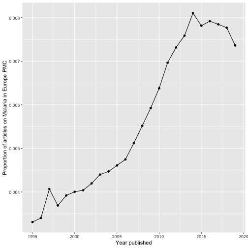

europepmc - R Interface to Europe PMC RESTful Web Service
=== 


[](https://travis-ci.org/ropensci/europepmc)
[](https://ci.appveyor.com/project/sckott/europepmc)
[](https://codecov.io/github/ropensci/europepmc?branch=master)
[](https://cran.r-project.org/package=europepmc)
[](https://github.com/metacran/cranlogs.app)
[](https://github.com/ropensci/onboarding/issues/29)

europepmc facilitates access to the [Europe PMC RESTful Web
Service](http://europepmc.org/RestfulWebService). The client furthermore supports the [Europe PMC Annotations API](https://europepmc.org/AnnotationsApi) to retrieve text-mined concepts and terms per article.

[Europe PMC](http://europepmc.org/) covers life science literature and
gives access to open access full texts. Europe
PMC ingests all PubMed content and extends its index with other literature and patent sources.

For more infos on Europe PMC, see:

<https://europepmc.org/About>

Levchenko, M., Gou, Y., Graef, F., Hamelers, A., Huang, Z., Ide-Smith, M., … McEntyre, J. (2017). Europe PMC in 2017. Nucleic Acids Research, 46(D1), D1254–D1260. <https://doi.org/10.1093/nar/gkx1005>

## Implemented API methods

This client supports the following API methods from the [Articles RESTful API](https://europepmc.org/RestfulWebService):

|API-Method     |Description                                                                                  |R functions                                |
|:--------------|:--------------------------------------------------------------------------------------------|:------------------------------------------|
|search         |Search Europe PMC and get detailed metadata                                                  |`epmc_search()`, `epmc_details()`, `epmc_search_by_doi()`          |
|profile        |Obtain a summary of hit counts for several Europe PMC databases                              |`epmc_profile()`                           |
|citations      |Load metadata representing citing articles for a given publication                           |`epmc_citations()`                         |
|references     |Retrieve the reference section of a publication                                               |`epmc_refs()`                              |
|databaseLinks  |Get links to biological databases such as UniProt or ENA                                     |`epmc_db()`, `epmc_db_count()`             |
|labslinks      |Access links to Europe PMC provided by third parties                                         |`epmc_lablinks()`, `epmc_lablinks_count()` |
|fullTextXML    |Fetch full-texts deposited in PMC                                                            |`epmc_ftxt()`                              |
|bookXML        |retrieve book XML formatted full text for the Open Access subset of the Europe PMC bookshelf |`epmc_ftxt_book()`                         |

From the [Europe PMC Annotations API](https://europepmc.org/AnnotationsApi):

|API-Method     |Description |R functions |
|:-----------|:-------------|:-------------|
annotationsByArticleIds | Get the annotations contained in the list of articles specified | `epmc_annotations_by_id()` |

## Installation

From CRAN

```r
install.packages("europepmc")
```

The latest development version can be installed using the
[remotes](https://github.com/r-lib/remotes/) package:


```r
require(remotes)
install_github("ropensci/europepmc")
```

Loading into R


```r
library(europepmc)
```

## Search Europe PMC

The search covers both metadata (e.g. abstracts or title) and full texts. To
build your query, please refer to the comprehensive guidance on how to search
Europe PMC: <http://europepmc.org/help>. Simply provide your query in the Europe
PMC search syntax to `epmc_search()`. 


```r
europepmc::epmc_search(query = '"2019-nCoV" OR "2019nCoV"')
#> # A tibble: 100 x 29
#>    id    source pmid  pmcid doi   title authorString journalTitle pubYear journalIssn pubType isOpenAccess inEPMC
#>    <chr> <chr>  <chr> <chr> <chr> <chr> <chr>        <chr>        <chr>   <chr>       <chr>   <chr>        <chr> 
#>  1 3240… MED    3240… PMC7… 10.1… Livi… Santillan-G… Med Intensi… 2020    "0210-5691… letter  Y            Y     
#>  2 PPR1… PPR    <NA>  <NA>  10.1… The … Benvenuto D… <NA>         2020     <NA>       prepri… N            N     
#>  3 3203… MED    3203… PMC7… 10.1… Emer… Malik YS, S… Vet Q        2020    "0165-2176… other;… Y            Y     
#>  4 3238… MED    3238… PMC7… 10.1… Comp… Yu R, Chen … Int J Antim… 2020    "1872-7913… resear… Y            Y     
#>  5 3203… MED    3203… PMC7… 10.1… Coro… Bonilla-Ald… Travel Med … 2020    "1477-8939… resear… Y            Y     
#>  6 3230… MED    3230… PMC7… 10.1… A ca… Yang X, Zha… Clin Res He… 2020    "2210-7401… case r… Y            Y     
#>  7 3220… MED    3220… PMC7… 10.4… Ther… Sarma P, Pr… Indian J Ph… 2020    "0253-7613… editor… Y            Y     
#>  8 PMC7… PMC    <NA>  PMC7… 10.1… Myst… Hemmati-Din… Arch Med Res <NA>    "0188-4409… review… Y            Y     
#>  9 3217… MED    3217… PMC7… 10.1… Anes… Zhao S, Lin… J Cardiotho… 2020    "1053-0770… resear… Y            Y     
#> 10 3232… MED    3232… PMC7… 10.1… The … Li H, Chen … J Infect     2020    "0163-4453… resear… Y            Y     
#> # … with 90 more rows, and 16 more variables: inPMC <chr>, hasPDF <chr>, hasBook <chr>, hasSuppl <chr>,
#> #   citedByCount <int>, hasReferences <chr>, hasTextMinedTerms <chr>, hasDbCrossReferences <chr>,
#> #   hasLabsLinks <chr>, hasTMAccessionNumbers <chr>, firstIndexDate <chr>, firstPublicationDate <chr>,
#> #   issue <chr>, journalVolume <chr>, pageInfo <chr>, versionNumber <int>
```

By default, `epmc_search()` returns 100 records. To adjust the limit, simply use
the `limit` parameter.

See vignette [Introducing europepmc, an R interface to Europe PMC RESTful API](https://ropensci.github.io/europepmc/articles/introducing-europepmc.html) for a long-form documentation about how to search Europe PMC with this client.

## Creating proper review graphs with `epmc_hits_trend()`

There is also a nice function allowing you to easily create review graphs like described in Maëlle
Salmon's [blog post](http://www.masalmon.eu/2017/05/14/evergreenreviewgraph/):


```r
tt_oa <- europepmc::epmc_hits_trend("Malaria", period = 1995:2019, synonym = FALSE)
tt_oa
#> # A tibble: 25 x 3
#>     year all_hits query_hits
#>    <int>    <dbl>      <dbl>
#>  1  1995   448961       1486
#>  2  1996   458444       1560
#>  3  1997   456594       1857
#>  4  1998   474525       1751
#>  5  1999   493574       1935
#>  6  2000   531892       2130
#>  7  2001   545533       2204
#>  8  2002   561118       2355
#>  9  2003   588172       2588
#> 10  2004   627729       2806
#> # … with 15 more rows
# we use ggplot2 for plotting the graph
library(ggplot2)
ggplot(tt_oa, aes(year, query_hits / all_hits)) + 
  geom_point() + 
  geom_line() +
  xlab("Year published") + 
  ylab("Proportion of articles on Malaria in Europe PMC")
```



For more info, read the vignette about creating literature review graphs:

<https://ropensci.github.io/europepmc/articles/evergreenreviewgraphs.html>

## Re-use of europepmc

Check out the tidypmc package

<https://github.com/ropensci/tidypmc>

The package maintainer, Chris Stubben (@cstubben), has also created an Shiny App that allows you to search and browse Europe PMC:

<https://cstubben.shinyapps.io/euPMC/>


## Other ways to access Europe PubMed Central

### Other APIs

- Data dumps: <https://europepmc.org/FtpSite>
- OAI service: <https://europepmc.org/OaiService>
- SOAP web service: <https://europepmc.org/SoapWebServices>
- Grants RESTful (Grist) API: <https://europepmc.org/GristAPI>

### Other R clients

- use rOpenSci's `oai` to get metadata and full text via Europe PMC's OAI interface: <https://github.com/ropensci/oai>
- use rOpenSci's `rentrez` to interact with [NCBI databases](http://www.ncbi.nlm.nih.gov/) such as [PubMed](http://www.ncbi.nlm.nih.gov/pubmed): <https://github.com/ropensci/rentrez>
- rOpenSci's `fulltext` package gives access to supplementary material of open access life-science publications in Europe PMC: <https://github.com/ropensci/fulltext>

## Meta

Please note that this project is released with a [Contributor Code of Conduct](CONDUCT.md). By participating in this project you agree to abide by its terms.

License: GPL-3

Please use the issue tracker for bug reporting and feature requests.

---

[](http://ropensci.org)
